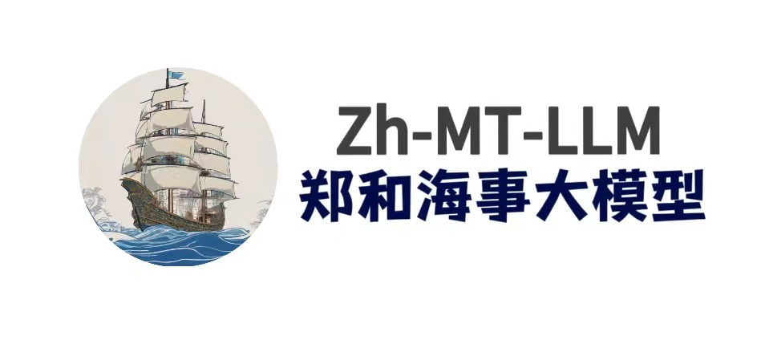

<div align="center">

ZH | [EN](./README-en.md)

<h1>郑和海事大模型（Zh-MT-LLM）</h1>

[](./LICENSE)[](https://huggingface.co/ZhangFuXi/Zh-MT-LLM)[]()

</div>

郑和海事大模型（Zh-MT-LLM）是大连海事大学智能技术实验室开发的一个面向海事领域从业人员、培训人员和学生，提供海事法律法规问答、海事教育培训、海事专业知识问答的垂直领域海事大模型。

对应以上三大板块,模型具有以下三大特点：

- 海事法律法规问答：模型从大量的海事相关法律法规内容中学习到了涉及海事领域的法律知识，可以为海事领域相关人员提供咨询服务。部分训练数据来源于共计 1.4w 条海事相关的法律法规，涵盖了国际公约、海事类法律、国务院文件、部委文件、行政法规、海事局文件以及司法解释文件等内容。
- 海事教育培训：首先，模型从来源于网络和教材中的海事专业试题学习到了一部分海事领域教育知识。其次，我们使用各种海事类职业考试大纲，其中包含《海船船员考试大纲》、《船舶载运危险货物申报人员考试大纲》和《危险货物集装箱装箱现场检查人员考试大纲》来生成了大量海事岗位培训知识来训练模型。另外模型还学习了一部分高质量的船员常见问答知识，以供培训人员答疑解惑。
- 海事各类专业知识问答：面向船舶、港口、海洋、航海等海事专业领域，模型学习了涉及船舶维修、船舶安全管理、港口运营和管理、海运物流、海事安全、航海技术、海洋环境保护、海洋科学研究相关知识，可以为海事各类专业从业人员提供答疑解惑。

本项目将陆续开源一系列**海事领域指令微调数据**和**海事大模型权重**，助力海事大模型的研究。

## 新闻 ✨

[2023/12/18] 正式发布郑和海事大模型（Zh-MT-LLM），并开源[Zh-MT-LLM v1.0模型](https://huggingface.co/ZhangFuXi/Zh-MT-LLM/tree/main)，以及该版本的 [LoRA模型权重](https://huggingface.co/ZhangFuXi/Zh-MT-LLM/tree/main/Zh-MT-LLM-lora)


## 功能展示

#### 海事法律法规问答

| 问题                                                     | Zh-MT-LLM                                                    |
| -------------------------------------------------------- | :----------------------------------------------------------- |
| SOLAS公约是什么？它对海上移动业务有哪些相关要求？        | SOLAS公约是国际海上人命安全公约（International Convention for the Safety of Life at Sea）的简称。它是国际海事组织（IMO）制定的一项重要公约，旨在确保海上船只和船员的安全。SOLAS公约对海上移动业务（如卫星通信、无线电台等）也提出了相关要求。\n\n具体来说，SOLAS公约规定了船只必须配备的必要设备，包括卫星通信设备、无线电台、雷达、自动识别系统等。此外，公约还规定了船只必须进行定期维护和检查，以确保这些设备的正常运行。\n\n此外，SOLAS公约还规定了船只必须配备的必要人员，包括船长、船员、通信员等。这些人员必须接受相应的培训，以确保他们能够熟练地操作和维护设备，并能够在紧急情况下采取适当的措施。\n\n总之，SOLAS公约对海上移动业务提出了严格的要求，旨在确保船只和船员的安全。这些要求的实施对于保障海上通信和运输的安全至关重要。 |
| 请解释《船员违法记分办法》的主要内容和适用范围。         | 《船员违法记分办法》是中国海事局颁布的一项法规，旨在对船员的违法行为进行记分，并规定相应的记分标准和处罚措施。其主要内容包括：\n\n1. 记分标准和处罚措施：船员违法行为会被记分，根据不同的违法行为，记分的分值也会不同。记分达到一定程度后，船员将面临相应的处罚，包括罚款、暂扣执照、吊销执照等。\n\n2. 记分周期：船员的记分周期为一年，每年初开始，到次年的同一天结束。\n\n3. 记分记录和查询：船员的记分记录将永久保留，并可以通过中国海事局官方网站进行查询。\n\n4. 记分申诉：船员可以在一定时间内对记分进行申诉，申诉结果将由中国海事局进行裁定。\n\n适用范围：《船员违法记分办法》适用于所有在中国境内从事航海活动的船员，包括海员、船长、船员等。 |
| 轮机值班船员在执行任务时发现机舱油污水外泄，该如何处理？ | 根据《中华人民共和国内河船舶船员值班规则》，值班轮机员应当随时注意机舱油污水外泄。如果一名轮机值班船员在执行任务时发现机舱油污水外泄，他应该立即采取措施进行处理。\n\n首先，他应该立即向轮机长报告情况，并提供详细的外泄情况描述。轮机长会根据情况做出相应的指示，如停止作业、调整船舶姿态等，以防止进一步的污染。\n\n其次，值班轮机员应尽快采取措施进行应急处理。他可以尝试使用适当的设备进行油污水的收集和处理，如油水分离器、油水回收装置等。同时，他也可以尝试使用吸油材料进行油污水的吸附和清除。\n\n最后，值班轮机员应密切监测机舱油污水的处理情况，并及时向轮机长汇报处理进展。轮机长会根据情况调整处理方案，并确保机舱油污水得到有效处理，以避免对环境造成污染。\n\n总之，值班轮机员在发现机舱油污水外泄时，应立即采取措施进行处理，并向轮机长报告情况，确保机舱油污水得到及时处理，以保护环境和船舶的安全。 |


#### 海事教育培训

| 问题                                                         | Zh-MT-LLM                                                    |
| :----------------------------------------------------------- | ------------------------------------------------------------ |
| 烟烙烬IG-541属于哪种类型的灭火剂？                           | 烟烙烬IG-541是一种洁净气体灭火剂，属于惰性气体灭火剂的范畴。它由氮气、二氧化碳和氩气组成，通过排除空气中的氧气来扑灭火源。这种灭火剂对环境和人体都是安全的，不会留下任何残留物。 |
| 如何正确穿戴和使用防护服以确保海员的安全？                   | 防护服在海事领域中起着至关重要的作用，它们能够保护海员免受有害物质、危险环境和传染病的侵害。以下是正确穿戴和使用防护服的几个关键步骤：\n\n1. 了解防护服类型：根据不同的任务和环境，防护服可以分为多种类型，如防护手套、防护服、护目镜、呼吸器等。海员应该了解不同类型的防护服，并选择适合特定任务的防护装备。\n\n2. 检查和维护：在使用防护服之前，海员应该仔细检查其外观和完整性。任何破损、损坏或不符合标准的防护服都应被淘汰。此外，防护服应定期进行维护和清洁，以确保其性能和防护能力。\n\n3. 穿戴正确：海员应该按照防护服的使用说明正确穿戴防护服。这可能包括佩戴手套、护目镜、呼吸器等。穿戴时应注意舒适性和紧固性，以确保防护服能够有效地保护身体。\n\n4. 使用正确的配件：海员应该使用正确的配件，如防护手套、护目镜、呼吸器等。这些配件应与防护服相匹配，以确保最佳的防护效果。\n\n5. 定期更换：防护服的寿命有限，海员应该定期更换防护服。一般来说，防护服的更换周期取决于其使用频率、环境条件和防护等级。海员应根据需要及时更换防护服，以确保其有效性。\n\n总之，正确穿戴和使用防护服是海员保护自身安全的重要步骤。海员应该了解防护服的类型和功能，正确穿戴和使用防护服，并定期更换以确保其有效性和安全性。 |
| 听说三副考试成绩可以作为值班水手考试成绩，具体是怎么样的？   | 根据《中华人民共和国海船船员适任考试和发证规则》的规定，三副考试成绩可以作为值班水手考试成绩，但前提是该三副考试成绩合格。具体来说，根据该规则的规定，三副考试成绩合格的可以作为值班水手考试成绩。 |
| 以下为一道多选题，请给出答案\n提单是指用以证明海上运输合同和由承运人接管或装载货物，以及承运人保证据以支付货物的单证，是班轮运输中的重要法律文件。有关提单的下列表述，正确的有:  \nA.提单只是运输合同的证明而非运输合同本身  \nB.提单在托运人手中时只是承运人接收货物的初步证据，如果承运人有确实证据证明其收到的货物与提单上的记载不符，承运人可以向托运人提出异议。但对于提单受让人来说，提单就成了终结性证据  \nC.银行一般只接受已装船提单，即由船长或承运人的代理人在货物装上指定的船舶后签发的提单 D.提单中注明的装船日期早于实际装船日期的称为预借提单 | A.提单只是运输合同的证明而非运输合同本身  \n\nB.提单在托运人手中时只是承运人接收货物的初步证据，如果承运人有确实证据证明其收到的货物与提单上的记载不符，承运人可以向托运人提出异议。但对于提单受让人来说，提单就成了终结性证据\n\nC.银行一般只接受已装船提单，即由船长或承运人的代理人在货物装上指定的船舶后签发的提单 |


#### 海事各类专业知识问答

| 问题                                                         | Zh-MT-LLM                                                    |
| ------------------------------------------------------------ | ------------------------------------------------------------ |
| 船舶操纵中常用的相关用语有哪些？请列举并解释其含义。         | 船舶操纵中常用的相关用语如下：\n\n1. 舵角：指舵柄或舵轮转动的角度，通常以度数表示。\n\n2. 舵速：指舵角变化的速度，通常以度数每分钟表示。\n\n3. 船速：指船舶在单位时间内所行驶的距离，通常以海里/小时表示。\n\n4. 航向：指船舶相对于地面的方向，通常以度数表示。\n\n5. 舵角指令：指船舶操纵员对舵角变化的要求，通常以度数表示。\n\n6. 舵角反馈：指舵角变化后舵柄或舵轮的位置，通常以度数表示。\n\n7. 船速反馈：指船舶实际行驶速度与船速之间的差异，通常以海里/小时表示。\n\n8. 航向反馈：指船舶实际航向与航向指令之间的差异，通常以度数表示。\n\n9. 舵角调整：指船舶操纵员对舵角变化进行调整，以使船舶按照指令行驶。\n\n10. 舵角修正：指船舶操纵员对舵角变化进行修正，以使船舶按照指令行驶，同时避免船舶受到风浪等因素的影响。 |
| 静电知识在油船运输中的重要性及应对措施是什么？               | 静电在油船运输中是一个非常重要的问题，因为油船在装卸油时会产生大量的静电。静电可以引起火灾和爆炸，因此必须采取适当的措施来防止静电的产生和积累。\n\n以下是一些常见的静电产生和积累的途径：\n\n1. 油品在装卸过程中的摩擦和碰撞。\n\n2. 油品在管道和储罐中的流动。\n\n3. 油品在油船船舱中的流动。\n\n4. 油船船舱内的金属结构和其他导电材料。\n\n以下是一些应对措施：\n\n1. 使用防静电材料和设备，如防静电地板、防静电垫、防静电手套、防静电衣服等。\n\n2. 在装卸油品时，使用防静电接地装置，将静电导入地面。\n\n3. 在油船船舱内安装防静电装置，如防静电油舱、防静电泵等。\n\n4. 在油船船舱内设置防静电涂料，如防静电涂料、防静电涂料、防静电涂料等。\n\n5. 在油船船舱内设置防静电管道和储罐，以减少静电的积累。\n\n6. 在油船船舱内设置防静电设备，如防静电泵、防静电阀等，以减少静电的产生。\n\n7. 在油船船舱内设置防静电接地装置，将静电导入地面。\n\n总之，静电在油船运输中是一个非常重要的问题，必须采取适当的措施来防止静电的产生和积累。 |
| 如何正确使用雷达进行避碰？                                   | 雷达是船舶上非常重要的导航工具，可以帮助船员识别其他船只、障碍物和危险区域。在海上航行时，正确使用雷达进行避碰是非常重要的。以下是一些使用雷达进行避碰的技巧：\n\n1. 设置合适的雷达范围：雷达范围应该根据船舶的大小和周围环境来设置。如果船舶太小，雷达范围应该设置为较小的范围，以减少干扰和误差。\n\n2. 监控雷达屏幕：在航行中，船员应该时刻监控雷达屏幕，以保持警觉。如果发现其他船只或障碍物，应该立即采取行动。\n\n3. 识别目标：在雷达屏幕上，船员应该能够识别出其他船只或障碍物。这可以通过观察雷达屏幕上的回波来完成。如果目标距离太远，船员应该尝试增加雷达范围，以更好地识别目标。\n\n4. 计算距离和速度：船员应该能够计算出其他船只或障碍物与自己的距离和速度。这可以通过观察雷达屏幕上的距离和速度信息来完成。\n\n5. 采取行动：如果发现其他船只或障碍物，船员应该立即采取行动。这可能包括改变航向、速度或距离目标。船员应该始终保持警觉，并时刻准备采取行动。\n\n总之，正确使用雷达进行避碰需要船员具备良好的观察力和判断力。船员应该时刻保持警觉，并时刻准备采取行动。 |
| 如何解决海洋酸化对珊瑚礁生态系统的影响？                     | 海洋酸化对珊瑚礁生态系统的影响是非常严重的，因为酸化会导致海水中的碳酸盐浓度下降，使得珊瑚礁骨骼中的碳酸钙溶解，从而导致珊瑚白化、死亡等问题。以下是一些可能的解决方案：\n\n1. 减少温室气体排放：温室气体的排放是导致海洋酸化的主要原因之一，因此减少温室气体的排放是解决海洋酸化问题的根本途径。\n\n2. 保护珊瑚礁：珊瑚礁是海洋生态系统的重要组成部分，因此需要采取措施来保护珊瑚礁，如建立保护区、限制捕捞等。\n\n3. 研究珊瑚的适应性：科学家们正在研究珊瑚的适应性，以了解它们如何应对酸化的环境，并寻找新的方法来保护珊瑚礁。\n\n4. 改善水质：改善水质可以减少酸化对珊瑚礁的影响，因此需要采取措施来减少污染和过度捕捞等。\n\n5. 加强国际合作：海洋酸化是全球性的问题，需要加强国际合作，共同应对这个问题。 |
| 在海事安全中，什么是VTS（船舶交通服务）系统，它的作用是什么？ | VTS（船舶交通服务）系统是一种用于监控和管理船舶交通的系统。它通过使用雷达、IS（自动识别系统）和其他传感器来跟踪船舶的位置、航向和速度等信息，并提供实时的船舶交通信息和建议。VTS系统可以帮助船舶避免碰撞、优化船舶交通流量、提高船舶安全性和减少排放。此外，VTS系统还可以提供紧急情况下的援助和救援服务。 |

## 模型评测

​	为了更全面地对比郑和海事大模型（Zh-MT-LLM）与通用领域大模型在海事领域内的性能差异。我们从客观题和主观题两个角度出发，构建了两个评测数据集，分别是 Zh-eval-opt 和 Zh-eval-qa。

### 客观题评测

​	Zh-eval-opt 客观题评测数据集包含800道选择题。题目内容尽可能广地覆盖了海事领域各类专业，同时也包含了船员培训的相关试题。我们使用准确度（Accuracy）来对比模型在该数据集上的性能。

#### 评测结果

|     模型      | 参数量 |  准确度  |
| :-----------: | :----: | :------: |
| Baichuan-Chat |   7B   |   37.4   |
|   ChatGLM3    |   6B   |   34.5   |
|   Qwen-Chat   |   7B   |   37.6   |
|   Atom-Chat   |   7B   |   31.2   |
|   Zh-MT-LLM   |   6B   | **41.0** |

​																		表2：客观题评测结果

### 主观题评测

​	Zh-eval-qa 数据量为2000。包含海事法律法规问答600道，海事教育培训600道，海事专业知识问答800道。主观题评测我们使用 GPT-3.5-Turbo 自动评测的方式来对比模型性能。

​	自动评测以参考资料作为基准答案，对各个模型给出的答案从完整性、准确性和条理清晰与否三个角度进行评分，分数区间为1-5分。综合得分按照 $0.4*准确性+0.3*（完整性+清晰度）$的方式进行计算。

#### 评测结果

|     模型      | 参数量 |  准确性  |  完整性  |  清晰度  | 综合得分 |
| :-----------: | :----: | :------: | :------: | :------: | :------: |
| Baichuan-Chat |   7B   |   4.06   |   3.67   |   4.14   |   3.97   |
|   ChatGLM3    |   6B   |   4.09   |   3.65   | **4.16** |   3.98   |
|   Qwen-Chat   |   7B   |   3.37   |   3.34   |   3.60   |   3.43   |
|   Atom-Chat   |   7B   |   3.97   |   3.52   |   3.88   |   3.81   |
|   Zh-MT-LLM   |   6B   | **4.32** | **3.82** |   4.13   | **4.11** |

​																		表3：主观题评测结果

## 推理和部署

1. 下载本仓库内容至本地/远程服务器

```shell
git clone https://github.com/ITRECLab/Zh-MT-LLM.git
```

2. 创建conda环境

```shell
conda create --name zh-mt-llm python=3.9
conda activate zh-mt-llm
```

3. 安装依赖

```shell
cd Zh-MT-LLM
pip install -r requirements.txt
```

4. 下载 [全参模型权重](https://huggingface.co/ZhangFuXi/Zh-MT-LLM)，如果本地有 ChatGLM3-6b-base 模型可以选择下载 [LoRA模型权重](https://huggingface.co/ZhangFuXi/Zh-MT-LLM/tree/main/Zh-MT-LLM-lora)
5. 使用如下代码进行推理：

```python
import torch
import argparse
from transformers import AutoModelForCausalLM, AutoTokenizer,AutoModel
from peft import PeftModel
# Argument Parser Setup
parser = argparse.ArgumentParser()
parser.add_argument("--model", type=str, default="ZhangFuXi/Zh-MT-LLM",
                    help="The directory of the model")
parser.add_argument("--tokenizer", type=str, default="ZhangFuXi/Zh-MT-LLM", help="Tokenizer path")
parser.add_argument("--adapter", type=str, default=None,
                    help="Path to the LoRA model checkpoint")
args = parser.parse_args()

if args.tokenizer is None:
    args.tokenizer = args.model
# 加载model
model = AutoModelForCausalLM.from_pretrained(
    args.model,
    trust_remote_code=True,
    low_cpu_mem_usage=True,
    torch_dtype=torch.float16,
    device_map='auto'
)
# 加载adapter
if args.adapter is not None:
    model = PeftModel.from_pretrained(model, args.adapter)
# 加载tokenizer
tokenizer = AutoTokenizer.from_pretrained(args.tokenizer, trust_remote_code=True)
model = model.eval()
meta_instruction = "你是ITREC实验室开发的郑和，一个海事领域的专家。请为用户尽可能地提供帮助。注意用词的安全性，不要做任何违法的事情。\n"
user_input = "你好。"
prompt = meta_instruction + user_input
response, history = model.chat(tokenizer, prompt, history=None)
print(response)
```


## 模型训练

郑和海事大模型（Zh-MT-LLM）选择 [ChatGLM3-6B-base](https://github.com/THUDM/ChatGLM3) 作为基座模型，该模型具有在 10B 以下的基础模型中最强的性能。 为了有效改善模型效果并且有较高的微调效率，我们选择使用 QLoRA 在 2*A800GPU 上进行指令微调。微调代码参考[Firefly](https://github.com/yangjianxin1/Firefly)项目执行以下命令：

```shell
torchrun --nproc_per_node=2 train_qlora.py --train_args_file train_args/qlora/chatglm3-6b-sft-qlora.json
```

微调使用的主要参数如下：

```json
{ 
    "num_train_epochs": 2,
    "per_device_train_batch_size": 20,
    "gradient_accumulation_steps": 2,
    "learning_rate": 0.0002,
    "max_seq_length": 1024,
    "logging_steps": 20,
    "save_total_limit": 10,
    "lr_scheduler_type": "constant_with_warmup",
    "warmup_steps": 0.1,
    "lora_rank": 64,
    "lora_alpha": 32,
    "lora_dropout": 0.05,
    "weight_decay": 0,
    "max_grad_norm": 0.3,
}
```


## 训练数据

​	训练数据使用面向三大板块组织的海事领域数据 Zh-mt-sft，以及30w条通用对话数据 [moss-003-sft-data](https://huggingface.co/datasets/fnlp/moss-003-sft-data)。Zh-mt-sft具体包含海事法律法规问答相关的 CrimeKgAssitant-1.8w、Zh-law-qa、Zh-law-court，海事教育培训相关的Zh-edu-qa、Zh-edu-qb，以及海事专业知识问答相关的 Zh-mt-qa。

Zh-mt-sft构造方法如下：

#### 海事法律法规问答

​	海事法律法规问答板块共包含有三种服务：

- 海事法律法规咨询
- 法院认为
- 判决预测

​	为提供海事领域特色的法律法规咨询服务，本项目收集了共计**1.4w**条海事相关的法律法规，涵盖了国际公约、海事类法律、国务院文件、部委文件、行政法规、海事局文件以及司法解释文件等内容。基于以上收集的信息，我们设计并迭代了提示词，使用 **GPT-3.5-Turbo **生成了共计**5.9w**条海事法律法规咨询数据。我们从其中抽取了**1.3k**条涉及海商法的法律咨询数据，由海商法专业人员进行改写，在提升回复专业性的同时对齐了人类偏好。另外，我们从 **CrimeKgAssitant** 真实场景下法律咨询数据集中，清洗并筛选出**1.8w**条质量较高的数据，来增加法律咨询的通用性。

​	法院认为和判决预测部分共计**5.6k**条数据，收集自北大法宝网中海事相关的真实司法案例。截取其中案件信息描述部分作为输入，法院认为和法院判决内容分别作为两个业务的输出。

#### 海事教育培训

​	海事教育培训包含两大服务内容：

- 海事专业题库
- 海事教育咨询

​    海事专业题库收集自网络以及校内的各类海事相关专业题库，其中包含一部分从网上收集的船员考证相关试题，共计**2.3w**条。

​	海事教育咨询服务面向海事领域各类培训人员以及海事专业学生，提供专业知识相关的教育咨询服务。数据来源于三部分：第一部分，我们收集了海事领域培训人员考试大纲，例如《海船船员考试大纲》、《从事船舶载运危险货物进出港口申报人员考试大纲》。根据大纲中的知识点，我们设计并迭代了提示词，使用 GPT-3.5-Turbo 生成了**2.2w**条数据。第二部分，我们从网络上收集了高质量的船员职业常识问答数据共计**1k**条。第三部分，我们将题库中一部分涉及专业知识的试题，使用 GPT-3.5-Turbo 改写为了咨询形式，并筛选出其中**1.6w**条高质量数据，来增加咨询数据中的海事领域专业知识。

#### 海事专业知识问答

​	对于该部分数据我们首先设计并迭代了提示词，使用两种方法来获取数据，一种是GPT-3.5-Turbo自问自答的形式，一种是GPT-3.5-Turbo提问GPT-4.0-Turbo解答的形式。对于通过以上两种方式生成出的**7.2w**条数据，我们通过清洗和筛选后保留了**4.6w**条高质量数据用于微调。

以上数据集具体统计信息如下：

<table>
    <tbody style="text-align: center;">
    <tr>
        <th>服务板块</th>
        <th>子任务</th>
        <th>数据集</th>
        <th>数据量</th>
    </tr>
    <tr>
        <td rowspan="4">海事法律法规问答</td>
        <td rowspan="2">海事法律咨询</td>
        <td>CrimeKgAssitant </td>
        <td>18,279</td>
    </tr>
    <tr>
        <td>Zh-law-qa</td>
        <td>59,244</td>
    </tr>
    <tr>
        <td>法院认为</td>
        <td>Zh-law-court</td>
        <td>2,684</td>
    </tr>
    <tr>
        <td>判决预测</td>
        <td>Zh-law-predict</td>
        <td>3,004</td>
    </tr>
    <tr>
        <td rowspan="2">海事教育培训</td>
        <td>海事教育咨询</td>
        <td>Zh-edu-qa</td>
        <td>41,052</td>
    </tr>
    <tr>
        <td>海事专业题库</td>
        <td>Zh-edu-qb</td>
        <td>23,531</td>
    </tr>
    <tr>
        <td rowspan="4">海事专业知识问答</td>
        <td>船舶知识</td>
        <td rowspan="4">Zh-mt-qa</td>
        <td rowspan="4">46,759</td>
    </tr>
        <tr>
        <td>航海知识</td>
    </tr>
        <tr>
        <td>港口知识</td>
    </tr>
        <tr>
        <td>海洋知识</td>
    </tr>
        <tr>
        <td rowspan="1">通用对话</td>
        <td></td>
        <td>moss-003-sft-data</td>
        <td>300,000</td>
    </tr>
        <tr>
        <td>总计</td>
        <td colspan="3">494,553</td>
    </tr>
    </tbody>
</table>

指令数据资源以及郑和大模型技术手稿正在整理和完善，相关资源将陆续发布。

## 声明

由于模型参数量限制、训练数据的清洗程度等因素，本项目开源的模型可能存在以下局限性：

- 由于未经过无害化微调，可能会产生歧视、危害、违背伦理道德的言论。
- 由于缺乏对真实世界的准确理解，模型可能会产生幻觉性回复，误导用户。
- 模型的训练数据可能包含有偏见的数据，用户应谨慎处理模型回应中的潜在偏见问题。

- 由于模型参数量受限，可能无法涵盖所有领域的知识，导致在某些主题上的回复不够准确或完整。

- 在处理特定领域的事实性知识时，模型可能因信息不足或误解而提供错误的答案，导致误导或混淆。

鉴于以上模型的局限性，我们要求本项目的代码、数据、模型不得用于对社会造成危害的用途，并且必须遵循基座模型的[MODEL_LICENCE](https://github.com/THUDM/ChatGLM3/blob/main/MODEL_LICENSE)。 我们不对因使用 Zh-MT-LLM 所引发的任何问题、风险或不良后果承担责任。 

## 开发团队

郑和海事大模型（Zh-MT-LLM）由大连海事大学智能技术实验室（ITREC）大模型项目组开发。

指导教师：张益嘉

学生成员：张富玺、付生博、周一鸣、万秉宇、张峻玮、李松涛、张诗笛、王世龙、程俊凯、尹伟鸣、裴清华、李晓博、赵启雲、朴承权、孙伟豪 、李振鑫、王锦帆 、姜宇凡、孙林、关金筑、苌帅、马子怡、王畅、陈帅

合作邮箱：zhangyijia@dlmu.edu.cn

## 致谢

感谢北京华夏电通科技股份有限公司大连分公司、大连海事大学信息科学技术学院高性能计算中心提供的支持和帮助，同时感谢以下开源项目对本项目的启发和帮助：

- https://github.com/THUDM/ChatGLM3
- https://github.com/DUTIR-BioNLP/Taiyi-LLM
- https://github.com/yangjianxin1/Firefly
- https://github.com/FudanDISC/DISC-LawLLM
- https://github.com/liuhuanyong/CrimeKgAssitant

## Star History

[](https://star-history.com/#ITREC/Zh-MT-LLM&Date)